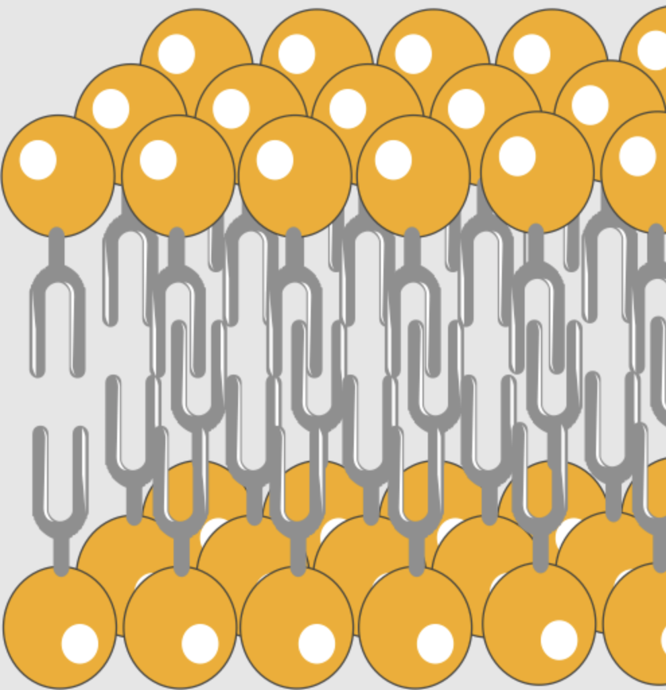
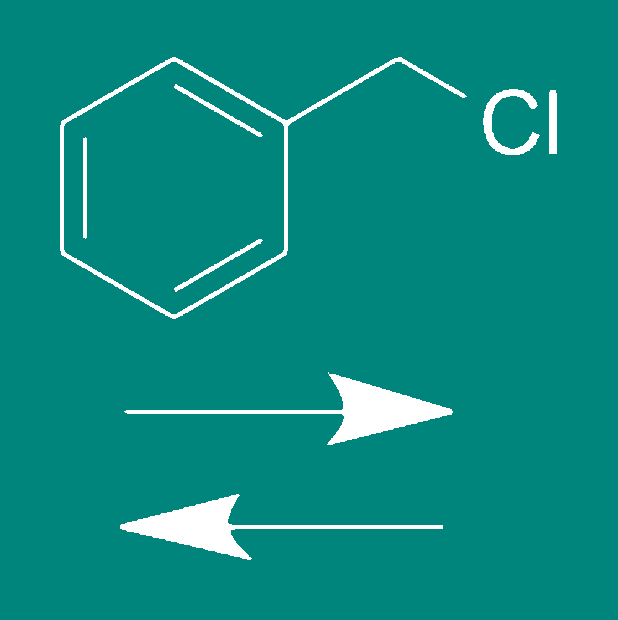

# Find the amino acid!

Welcome to "Find the amino acid!" This game challenges you to find the correct form of an amino acid molecule that the source laboratory produces as quickly as possible.

For a compound to be an amino acid, it needs to have a -NH2 and -COOH functional group. Those molecules are the building blocks that make up proteins and peptides by reacting the 2 functional groups to form

[Peptide bond](https://en.wikipedia.org/wiki/Peptide_bond) -C(O)NH-.

## How to play?

When starting a game, the cards are shuffled, and they form a circle in the game field.

There are 4 types of cards in the game:
* *laboratory* cards - they indicate the laboratories, which produce the amino acids. They differ in colour:

  

* *molecule* cards which represent different forms of an amino acid. Here you can see a glycine molecule in neutral form:

* *cell membrane* cards - they are used to travel through the circle while skipping all the cards between them. Like a teleport!

* *chemical reaction* cards - they alter the molecule in a specific way; thoroughly explained below!

The inital amino acid appears in the middle of the circle, along with the picture of the laboratory in which it is produced. An arrow indicates the direction in which you go. A white arrow signifies the clockwise direction, while a black arrow represents the counter-clockwise direction.

Track the molecule from the source laboratory in the indicated direction until you find the correct form. But beware! It has 2 catches:
* The molecule can undergo a chemical reaction on the way.
* The molecule may pass through a cell membrane, skipping the cards between the two sides of the membrane (in other words, skipping the cards until next membrane card is reached).

### Trivia
When chemist needs to create a peptide, it is necessary to protect the C-end or the N-end of the molecule by some protecting group (PG). For protecting the N-end, Boc ([*tert*-Butyloxycarbonyl](https://en.wikipedia.org/wiki/Tert-Butyloxycarbonyl_protecting_group)) group is often used. It is introduced to the molecule by reacting with Boc-anhydride (Boc2O).
For protecting the C-end, Bn (benzyl) group can be used. It is introduced by reacting the acid with [Benzyl chloride](https://en.wikipedia.org/wiki/Benzyl_chloride).
Both reactions are reversible.

### Game rules continuation
When the molecule reaches one of the reaction cards, it undergoes chemical transformation.
* Boc (de)protection:

   
* Benzyl (de)protection:

   
* Enzymatic biotransformation by Serine hydroxymethyltransferase:

   

The last one is a reaction, that some organisms use to transform Serine to Glycine amino acid and *vice versa*.
If the molecule goes through any of the transformations for the second time, it is deprotected / switched between Glycine and Serine (the reactions are reversible).

The reactions do not work with 100 % efficiency though. If the molecule undergoes any transformation forth time, it is destroyed, and the goal of the game is to click on the card with the latest transformation.

Once you select the correct card with the molecule, an animation is played showing the path of the molecule.
If you select a card and it only changes color to blue without any animation, you have chosen the wrong card. Try again!

Have fun!

## Acknowledgements

The game principle is taken from Panic Lab board game by Dominique Ehrhard.
The cell membrane image is from [Wikipedia](https://commons.wikimedia.org/w/index.php?title=File:Cell_membrane_21_--_Smart-Servier.png&oldid=852241904) with creative-commons license.
Other images were drawn by hand in ChemDraw and MS PowerPoint.
