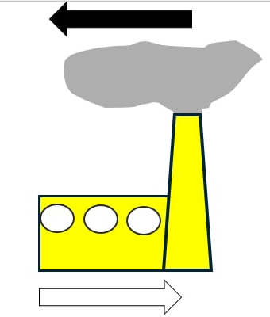
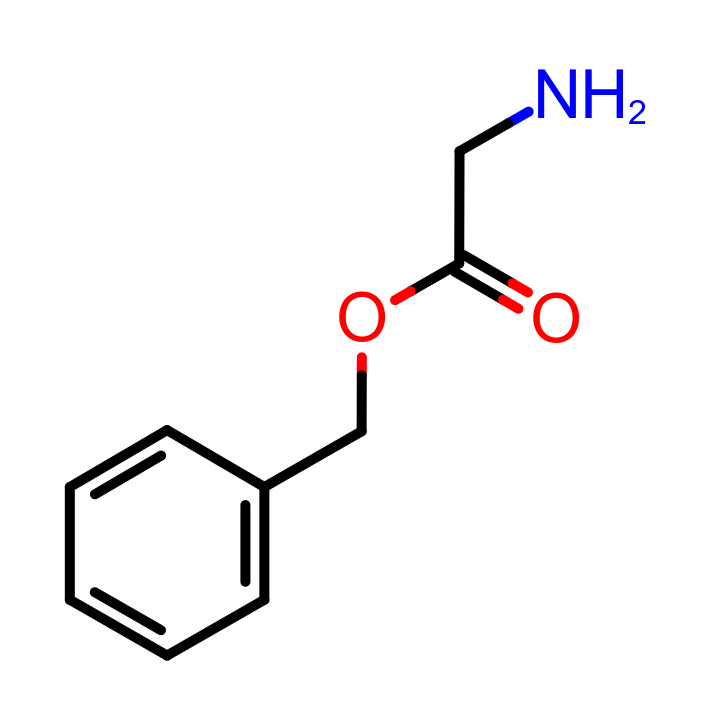
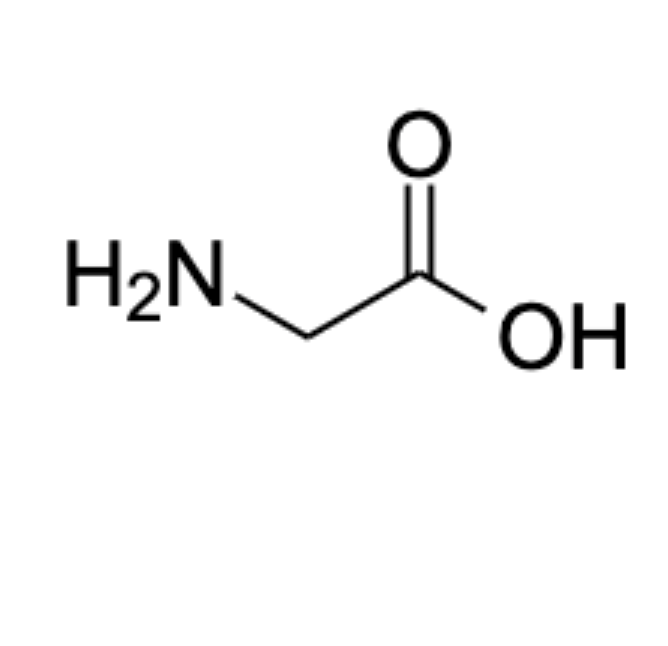

# Find the missing amino acid!

This is a game about finding an amino acid molecule in a correct form as fast as possible.

## How to play?

When starting a game, the cards are shuffled, and they form a circle in the game field.

There are 4 types of cards in the game:
* *laboratory* cards - they indicate the laboratories, from which the amino acid is missing. They differ in colour:

  

* *molecule* cards which represent different forms of an amino acid. Here you can see a glycine molecule in neutral form:

* *cell membrane* cards - they are used to travel through the circle while skipping all the cards between them. Like a teleport!

* *chemical reaction* cards - they alter the molecule in a specific way; thoroughly explained lower!

The missing amino acid appears in the middle of the circle. For a compound to be an amino acid, it needs to have a -NH_2 and -COOH functional group. Those molecules are the building blocks that make up proteins and peptides by reacting the 2 functional groups to form [Peptide bond](https://en.wikipedia.org/wiki/Peptide_bond) bond -C(O)NH-.

Together with the molecule, also the picture of the laboratory, from which the amino acid is missing is showed in the middle. And also, a black or white arrow indicating the direction, to which we should look for the missing molecule. White means clockwise direction, black means counter-clockwise.

Now we track the molecule from the source laboratory in the direction until the molecule is found. But beware! it has 2 catches: the molecule can undergo a chemical reaction on the way, and it can also go through a cell membrane and skip the places between the 2 sides of the membrane.

When chemist needs to create a peptide, it is necessary to protect the C-end or the N-end of the molecule by some protecting group (PG). For protecting the N-end, Boc ([*tert*-Butyloxycarbonyl](https://en.wikipedia.org/wiki/Tert-Butyloxycarbonyl_protecting_group)) group is often used. It is introduced to the molecule by reacting with Boc-anhydride (Boc_2O).
For protecting the C-end, Bn (benzyl) group can be used. It is introduced by reacting the acid with [Benzyl chloride](https://en.wikipedia.org/wiki/Benzyl_chloride).
Both reactions are reversible.

When the molecule reaches one of the reaction cards, it undergoes chemical transformation.
* Boc protection:

   
* Benzyl protection:

   
* Enzymatic biotransformation by Serine hydroxymethyltransferase:

   

The last one is a reaction, that some organisms use to transform Serine to Glycine amino acid and *vice versa*.
If the molecule goes through any of the transformations for the second time, it is deprotected / switched between Glycine and Serine (the reactions are reversible).

The reactions do not work with 100 % efficiency though. If the molecule undergoes any transformation forth time, it is destroyed, and the goal of the game is to click on the card with the latest transformation.

Once you select the correct card with the molecule, an animation is played showing the path of the molecule.
If the selected card only changes color to blue and no animation is played, you have selected wrong card, and you can try again. 

# Acknowledgements

The game principle is taken from Panic Lab board game by Dominique Ehrhard.
The cell membrane image is from [Wikipedia](https://commons.wikimedia.org/w/index.php?title=File:Cell_membrane_21_--_Smart-Servier.png&oldid=852241904) with creative-commons license.
Other images were drawn by hand in ChemDraw and MS PowerPoint.
